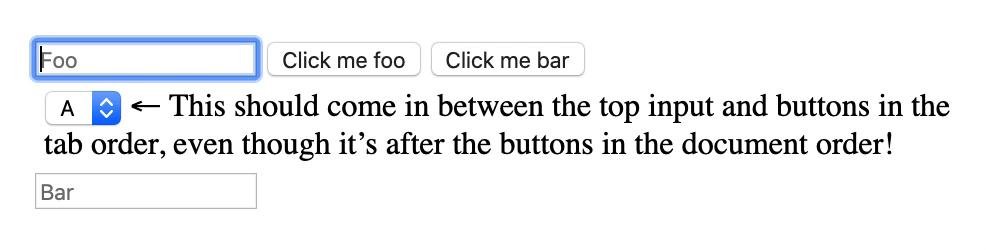

# react-tab-portal

Customize the tab order to jump to a different section of the document _without_
modifying every single `tabindex` on the entire page!



Useful when you have a component (like a dropdown) whose DOM hierarchy cannot match
the desired tab order for design purposes (e.g. it needs to reference a different `position: relative` parent, or stay in flow to take up the available width/height).

## Usage

Every tab portal must have a `<TabPortal.Content>` (the section of tabbable
elements you want to be out of order) and a `<TabPortal.Portal>` (the element
that will skip you to the content when reached in the tab order). Thing of the
portal like an entrance to the content, and the end of the content has an exit
back to the portal!

You can link the `<TabPortal.Content>` and `<TabPortal.Portal>` elements in
two ways.

### Automatic grouping via context

Wrap both elements in an ancestor `<TabPortal>` to automatically link them.
Because they share the same ancestor `<TabPortal>`, they are linked.

```jsx
import { TabPortal } from "react-tab-portal";

function MyComponent() {
  return (
    <TabPortal>
      <div>
        <input placeholder="Foo" />
        <TabPortal.Portal />
        <button>One</button>
        <button>Two</button>
      </div>
      <TabPortal.Content>
        <select>
          <option>Apples</option>
          <option>Bananas</option>
          <option>Carrots</option>
        </select>
      </TabPortal.Content>
      <input placeholder="Bar" />
    </TabPortal>
  );
}
```

### Explicit grouping via useTabPortal

Pass the result of `useTabPortal` to the `to` and `from` props to link the
`<TabPortal.Portal>` and `<TabPortal.Content>` elements manually.

```jsx
import { TabPortal, useTabPortal } from "react-tab-portal";

function MyComponent() {
  const tabPortal = useTabPortal();

  return (
    <TabPortal>
      <div>
        <input placeholder="Foo" />
        <TabPortal.Portal to={tabPortal} />
        <button>One</button>
        <button>Two</button>
      </div>
      <TabPortal.Content from={tabPortal}>
        <select>
          <option>Apples</option>
          <option>Bananas</option>
          <option>Carrots</option>
        </select>
      </TabPortal.Content>
      <input placeholder="Bar" />
    </TabPortal>
  );
}
```
